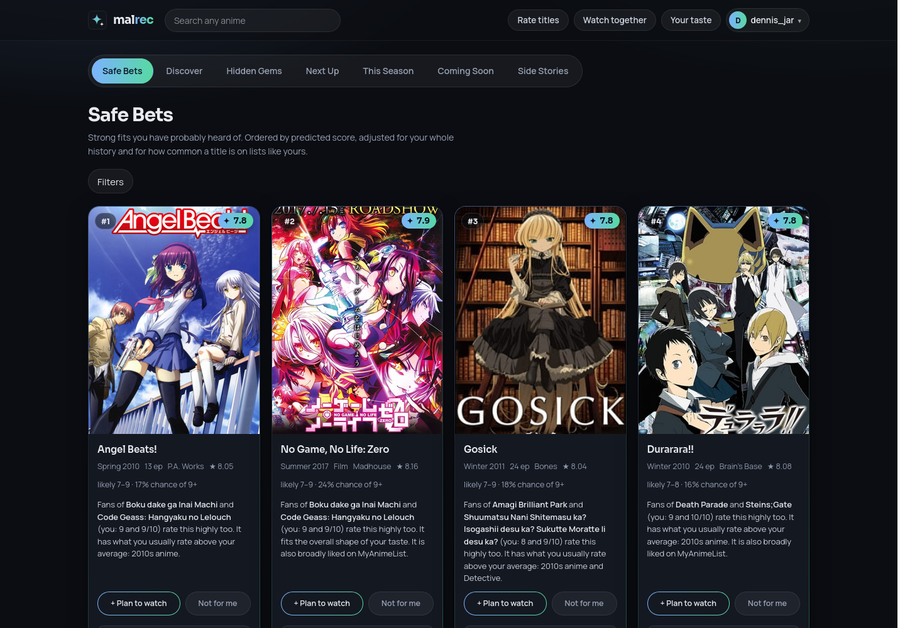
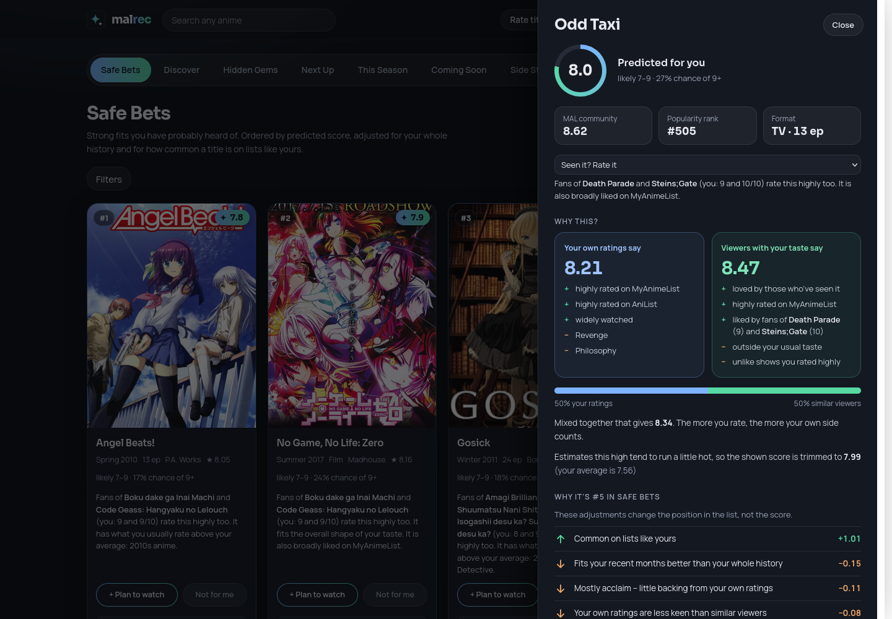

<p align="center">
  
</p>

<h1 align="center">malrec</h1>

<p align="center">
  <b>Your next favourite anime, picked from your own MyAnimeList ratings ✨</b><br>
  <sub>and it explains why it picked each one.</sub>
</p>

<p align="center">
  <a href="https://mal.dschw.ninja"></a>
  
  
  
  
  <a href="LICENSE"></a>
</p>



---

## 🌟 What is this?

You've rated a hundred shows on MyAnimeList. "Top anime of all time" lists
already know you've seen Steins;Gate. **malrec** learns what *you* actually
rate highly and goes looking for the rest.

| | |
|---|---|
| 🎯 **Safe Bets** | Strong matches backed by your own ratings, not just hype |
| 🧭 **Discover** | Good fits a step further from the obvious |
| 💎 **Hidden Gems** | Lesser-known titles that fit your taste |
| ⏭️ **Next Up** | The next season of the shows you finished and liked |
| 📺 **This Season** | What's airing right now, ranked for you |
| 📅 **Coming Soon** | Announced sequels and films from franchises you love |
| 🎁 **Side Stories** | OVAs and specials from series you already know |

Along with the lists:

- 🤔 **"Why this?" on every pick.** See what *your* ratings say, what *viewers
  like you* say, and why a title landed where it did. Nothing is a black box.
- ✍️ **Writes back to MAL.** Add to Plan to Watch and rate titles straight
  from the app.
- 🎲 **A quick rating round** sharpens a brand-new profile in a minute.
- 👯 **Watch together.** Pair up with a friend for a list you'll both enjoy.
  Only predicted scores are shared, never your lists.
- 🌍 English and German.



## 🧠 How it works, in 30 seconds

1. **👥 The crowd.** A population model learned from thousands of public MAL
   lists knows which shows people who share a taste rate highly.
2. **🪞 You.** A personal model is fitted to *your* ratings: genres, themes,
   studios, eras, how long a show runs.
3. **⚖️ The blend.** With a short list, the crowd does most of the work. The
   more you rate, the more your own model takes over.
4. **🛡️ The sanity check.** Picks that rest on acclaim alone, with nothing on
   your list backing them, are moved down. So are very long series and
   genres you've never touched.

Every setting was measured on held-out users before it shipped. The full
story, with the numbers, is in **[docs/MODEL.md](docs/MODEL.md)**.

## 🚀 Try it

👉 **<https://mal.dschw.ninja>**

Sign in with your MyAnimeList account. New accounts **need to be approved
first** ⏳, so you'll see a short waiting screen until that happens. Then your
lists are built in under a minute.

## 🏠 Run your own instance

All you need is **Docker** and a free **MyAnimeList API client**.

### 1️⃣ Register a MAL API client

Go to <https://myanimelist.net/apiconfig> → *Create ID*, and set
**App Redirect URL** to:

```
http://localhost:3000/api/auth/callback
```

Keep the **Client ID** and **Client Secret** handy.

### 2️⃣ Get the code and configure it

```bash
git clone https://github.com/knarxy/malrec.git
cd malrec
cp .env.example .env
```

Open `.env` and fill in these lines:

| Setting | What to put there |
|---|---|
| `MAL_CLIENT_ID` | your Client ID |
| `MAL_CLIENT_SECRET` | your Client Secret |
| `ADMIN_USERS` | your MAL username (you'll approve other users) |
| `MALREC_USER` | your MAL username again |
| `POSTGRES_PASSWORD` | any password you like |
| `TOKEN_KEY` | the output of the command below 👇 |

```bash
python3 -c "import base64,os;print(base64.urlsafe_b64encode(os.urandom(32)).decode())"
```

### 3️⃣ Start it

```bash
docker compose up -d --build
```

### 4️⃣ Teach it what people watch (one time)

This reads a sample of public MAL lists and builds the population model. It
takes a few hours ☕ and can be stopped and resumed at any time.

```bash
docker compose --profile lab run --rm lab malrec sync full
docker compose --profile lab run --rm lab malrec population fit
```

### 5️⃣ Sign in 🎉

Open **<http://localhost:3000>** and sign in with MyAnimeList. You're the
admin, so you're approved automatically. Other users will show up in the
admin panel (account menu) for you to approve.

<details>
<summary>🌐 <b>Putting it on the internet</b></summary>

<br>

Put a reverse proxy with HTTPS (Caddy, Traefik, nginx, …) in front of port
`3000`, then set these in `.env`:

```env
MAL_REDIRECT_URI=https://your.domain/api/auth/callback
APP_BASE_URL=https://your.domain
SESSION_COOKIE_SECURE=true
```

Use the same redirect URL in your MAL API client, then run
`docker compose up -d` again. Everything binds to `127.0.0.1` by default, so
nothing is exposed until you choose to.

</details>

<details>
<summary>🕰️ <b>Optional: keep everything fresh automatically</b></summary>

<br>

`scripts/malrec.cron` has a nightly list sync and backup, a weekly "coming
soon" refresh and a monthly refit of the population model. Adjust the path
and copy it to `/etc/cron.d/malrec`.

</details>

## 📚 Dig deeper

- 📖 [docs/MODEL.md](docs/MODEL.md): the model, the ranking, every
  evaluation, the configuration, how to run it day to day
- 🔬 [docs/RESEARCH.md](docs/RESEARCH.md): the papers behind the choices
- 🧪 [experiments/](experiments): the experiment code and the logs of every
  measured change

Data comes from the [MyAnimeList API](https://myanimelist.net/apiconfig/references/api/v2)
and [AniList](https://anilist.co). malrec is a fan project and is not
affiliated with either.

## 💙 Credits

Vibe-coded with love by [dennis_jar](https://github.com/knarxy) and Claude
Opus 5.5. Released under the [MIT license](LICENSE).
